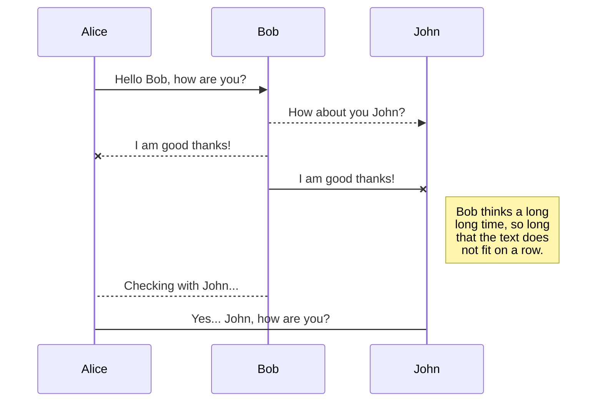
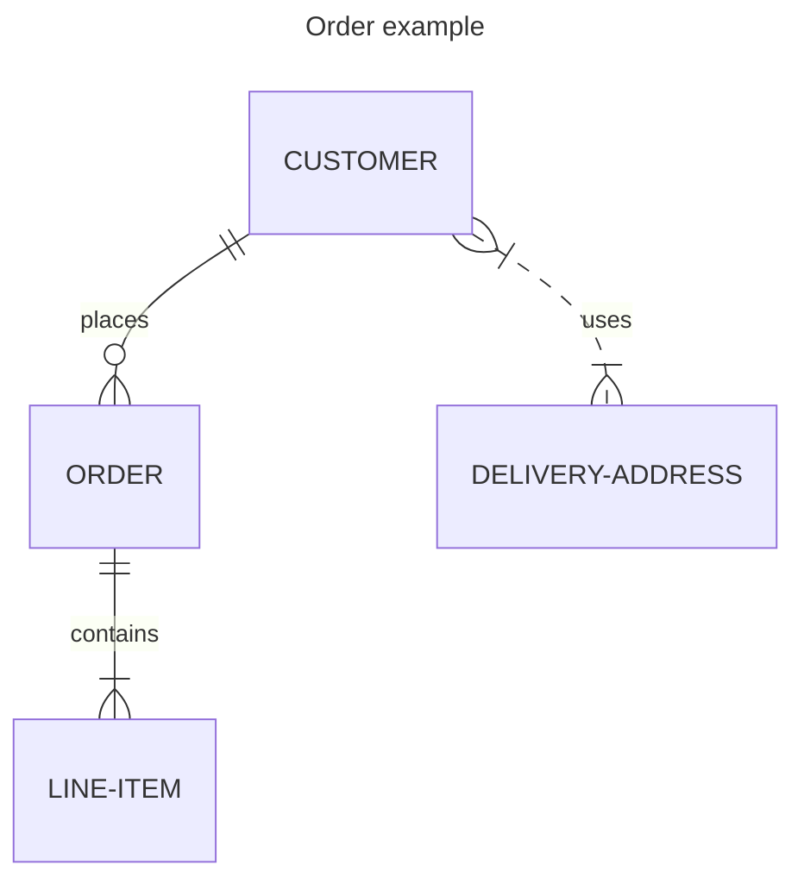

```Using Mermaid markdown to write this file```

HTML inside has the same content only difference is that will be generated using Js

```Sequence diagram is as```




```Another ER diagram is as```

