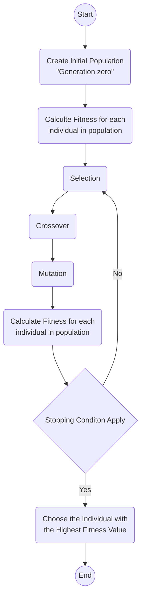

```mermaid
flowchart TD
    A((Start)) --> B("Create lnitial Population <br> #quot;Generation zero#quot;")
    B -->C(Calculte Fitness for each <br> individual in population)
    C --> D(Selection)
    D --> E(Crossover)
    E --> F(Mutation)
    F --> G(Calculate Fitness for each <br> individual in population)
    G --> H{Stopping Conditon Apply}
    H -->|No| D(Selection)
    H -->|Yes| I(Choose the Individual with <br> the Highest Fitness Value)
    I --> J((End))
```